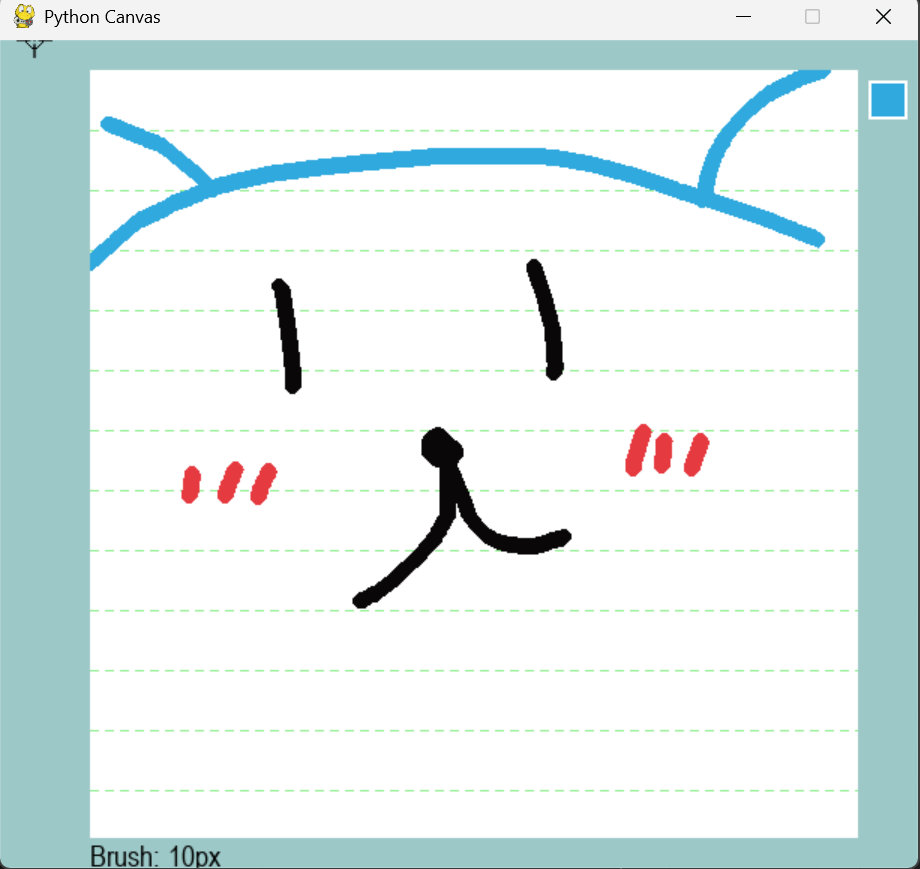
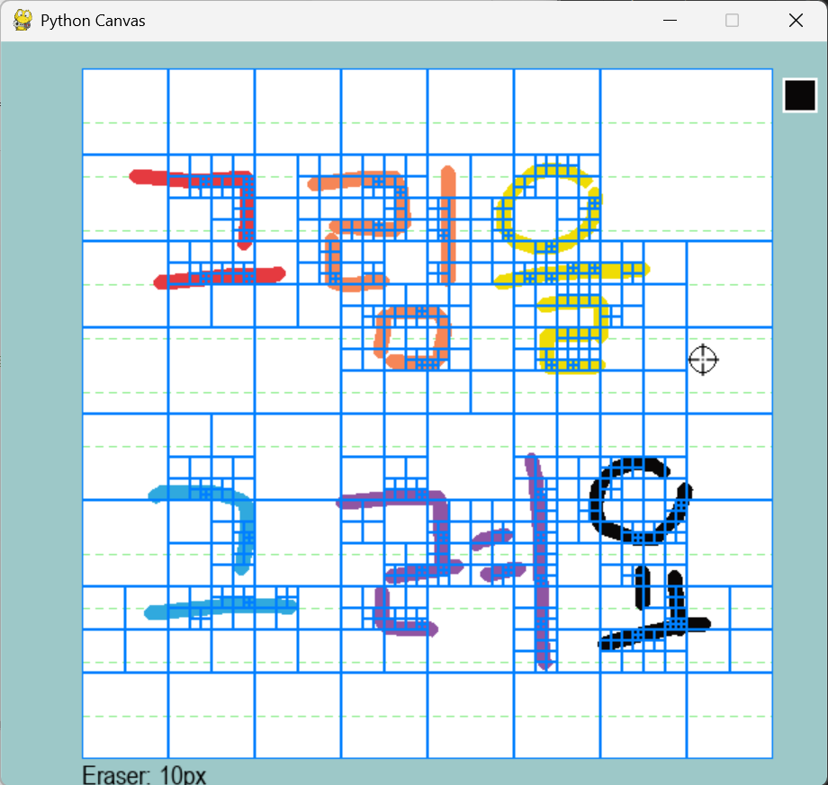

---

# 🖌️ Painter: 포토샵 클론 프로젝트

Python과 Pygame을 활용한 **간단한 포토샵 클론 프로젝트**입니다.  
벡터 기반의 브러시, 지우개, 레이어 시스템과 Undo/Redo, PNG 저장 기능 등을 지원합니다.

---

## ✨ 주요 기능

- 🎨 브러시 도구 (선 보간 포함)
- 🧹 지우개 도구
  - 획 지우기 (stroke erase)
  - 영역 지우기 (area erase)
- 📚 레이어 시스템
- ↩️ 실행 취소 / ↪️ 다시 실행
- 💾 PNG 이미지 저장
- 🔲 공책 배경 시각화
- 🧠 Quadtree 기반 빠른 지우기 최적화
- 🖱️ 툴바 UI 및 반경 조절 (마우스 휠)

---

## 🖼️ UI 구성

- 상단/하단/좌우 툴바: 배경 색상 및 현재 툴 표시
- 캔버스 영역: 브러시 및 지우개 사용 가능
- 커서 주변에 도구 반경 원 표시
- 우측 상단에 현재 색상 미리보기

---

## 🛠 사용 방법

### 1. 설치

```bash
pip install pygame numpy
````

### 2. 실행

```bash
python ./project/run.py
```

> `run.py`는 항상 프로젝트 루트에서 실행되도록 보장합니다.
> 커서 이미지는 `./resources/cursor.png`에 위치해야 합니다.

---

## ⌨️ 단축키 안내

| 키 조합               | 기능            |
| ------------------ | ------------- |
| `1`\~`6`           | 브러시 색상 변경     |
| `B`                | 브러시 모드로 전환    |
| `E + 1`            | 획 지우개 모드로 전환  |
| `E + 2`            | 영역 지우개 모드로 전환 |
| `Ctrl + Z`         | 실행 취소 (Undo)  |
| `Ctrl + Shift + Z` | 다시 실행 (Redo)  |
| 마우스 휠              | 브러시/지우개 반경 조절 |

---

## 🧩 디렉토리 구조

```
project/
│
├── engine/                # 드로잉 및 데이터 구조 정의
│   ├── canvas.py
│   ├── layer.py
│   ├── quadtree.py
│   ├── stroke.py
│   └── vectorlayer.py
│
├── handlers/              # 사용자 입력 처리
│   ├── color_tool.py
│   ├── mouse_input.py
│   ├── undo_redo.py
│
├── utils/                 # 상수, UI, 저장 함수
│   ├── constants.py
│   ├── helpers.py
│   └── ui.py
│
├── resources/
│   └── cursor.png         # 사용자 정의 커서 이미지
│
├── main.py                # 프로그램 메인 루프
└── run.py                 # 루트에서 실행을 보장하는 진입점
```

---

## 📦 기술 스택

* Python 3.x
* [Pygame](https://www.pygame.org/) – 2D 그래픽 렌더링
* NumPy – 픽셀 배열 처리
* Custom Quadtree – 지우개 최적화 구조

---

## 📌 향후 개선 계획

* ✅ PyQt 기반 GUI로 확장 (다중 창, 도킹 패널 등)
* ✅ 레이어 숨기기 / 잠금 기능
* ✅ 타임라인 및 히스토리 시각화

---

## 📸 예시 스크린샷

>
> ```
> 
> 
> ```

---

## 👨‍💻 제작자

* 프로젝트 제작자: \pinata0
* 개발 목적: Python 기반 드로잉 시스템 및 UI/UX 이해
